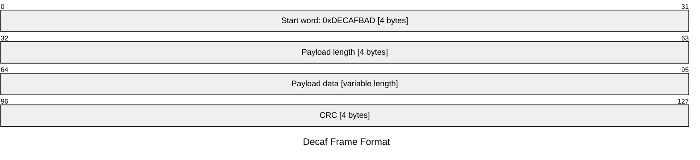

# Custom Framing Example

This directory contains an example of Custom Framing pattern for Flight Software. For the GDS side, please refer to the [GDS Framing Plugin](../../GdsExamples/gds-plugins/src/framing/).

This patterns enables the implementation of custom framing protocols for communication between FSW and a GDS. It consists of the [DecafFramer](./DecafFramer/) component, [DecafDeframer](./DecafDeframer/) component, and a [DecafFrameDetector](./DecafFrameDetector/).

This orchestration of components is instantiated in the [ExamplesDeployment](../ExamplesDeployment) topology. They can be dropped in a common topology, replacing the default FprimeFramer and FprimeDeframer components.

## Decaf Framing Protocol

The Decaf Framing Protocol is a simple and low-overhead protocol used in this example. It is similar to the default F Prime protocol and consists of a header (start word and length token), payload, and trailer (CRC).

| Patterns Demonstrated    |
|--------------------------|
| Custom Framing           |
